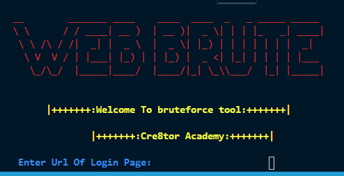

# webbrute
A website login Brute force Script

You need to install requirements by using

<code>pip install -r requirements.txt</code>

Run it by using

<code>python webbrute.py</code>  
You will See The Screen  
 
Watch Video For Detaild Information
Subscribe to the youtube chanell : <a href="https://www.youtube.com/channel/UCz_wC5AjM-8Dni7fGvqXzkw?view_as=subscriber">Cre8tor Academy<a>
